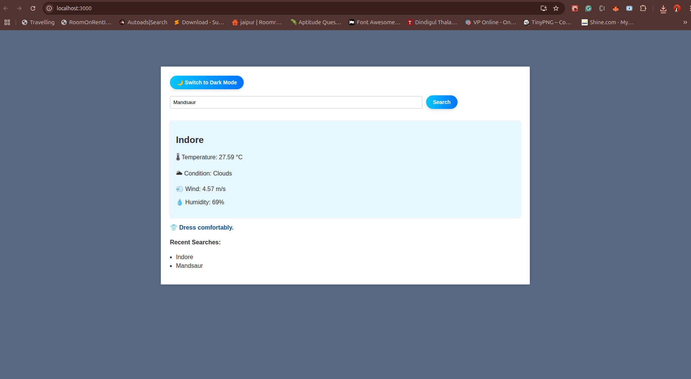

# 🌤️ Weather-Based Outfit Recommender 
A responsive React app where users can search for a city and get the current weather, along with outfit suggestions based on the weather conditions.


# start time : 2:10 PM , Date : 02 Aug 2025


## 🔧 Installation

1. **Clone the repository**
   ```bash
   git clone https://github.com/Arunsurawat/weather-based-outfit-recommender.git
   cd weather-based-outfit-recommenderweather-outfit-app
   ```

2. **System Requirements**

    Make sure your system meets the following requirements:

    Node.js: v16.x or higher

    npm: v8.x or higher (comes with Node.js)

    Operating System: Windows, macOS, or Linux

    Internet Connection: Required to fetch weather data from OpenWeatherMap API

    Browser: Latest version of Chrome, Firefox, or Edge

    To check versions:
    ```bash
        node -v
        npm -v
    ```

3. **Install dependencies**
   ```bash
   npm install
   ```

4. **Create `.env` file**
   Add your API key from [OpenWeatherMap](https://openweathermap.org/api):
   ```env
   REACT_APP_OPENWEATHER_API_KEY=your_api_key_here
   ```

---

## 🚀 Running the App Locally

```bash
npm start
```

The app will run at: [http://localhost:3000](http://localhost:3000)

---

## 📆 Build for Production

```bash
npm run build
```

---

## 🎯 Features

- 🌍 City-based weather search
- 🡥 Outfit recommendation based on temperature and conditions
- ⏱️ History of last 5 city searches
- ⚠️ Error handling for invalid cities or API failures
- 🌗 Theme toggle (Light/Dark)
- 🔄 Offline detection and retry logic
- 🧠 Auto-suggestions with debounced input (optional)
- 📱 Responsive design for mobile and desktop

---

## 💡 Assumptions & Decisions

- **API**: Used [OpenWeatherMap Current Weather API](https://openweathermap.org/current) to fetch real-time weather data.
- **API**: Used [City Suggetions API](https://wft-geo-db.p.rapidapi.com/v1/geo/cities) to fetch real-time city data.
- **Search History**: Stored in-memory only; cleared on page reload (no backend/localStorage used).
- **Outfit Logic**: Simplified and rule-based. Could be extended using AI or ML.
- **Framework**: Chose React (with TypeScript) for fast prototyping, state management via Context API for simplicity.
- **Auto-suggestions**: Debounced input implemented; city suggestion API optional and mocked for development.
- **Theme**: Light/Dark toggle stored in memory only; can be persisted with localStorage in future.

---

## 🖼️ Screenshots

>

---

## 📜 License

MIT License

---

## 🙇‍♂️ Author

Arun Surawat  
[LinkedIn](https://linkedin.com/in/arun-surawat-5b38b0179) | [GitHub](https://github.com/Arunsurawat)